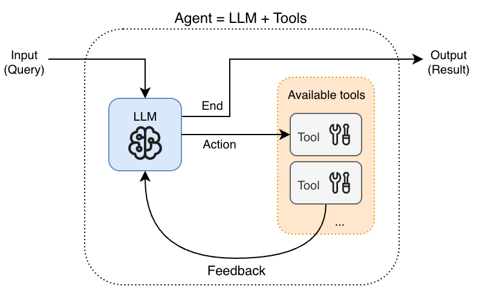
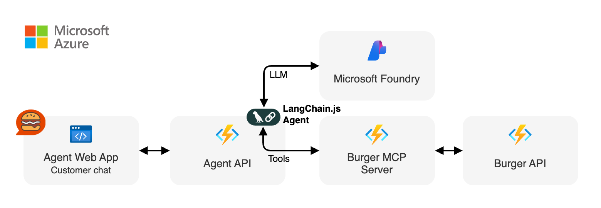

title: Agents IA, MCP and burgers with LangChain.js
class: animation-fade
layout: true

---

class: hide-handle, center, middle full, more-shadow
<!-- background-image: url(images/ai.jpg) -->

.title.center[
# Agents IA, MCP and burgers with LangChain.js
]

.full-layer.who.text-right.small.middle.light-text.darkened[
  .ms.responsive[]
  |
  Yohan | Philippe
]

---

class: center, middle, hide-handle
# Who are we?

.table.row.middle.center[
.col-2[]
.col-3.center[
  .w-70.responsive.avatar.bounceInLeft.animated[]

  **Yohan Lasorsa** 
  .fab.fa-linkedin[] .e[/yohanlasorsa] 
]
.col-3.center[
  .w-70.responsive.avatar.bounceInUp.animated[]

  **Philippe Didiergeorges** 
  .fab.fa-linkedin[] .e[/philippedidiergeorges] 
]
]

---

class: center, middle
# Why agents?

???

---

# What's MCP?

.w-80.responsive[]

---

# What's an AI agent?

.w-80.responsive[]

---

class: center, middle
# What we'll build today

---

# High-level architecture

.w-80.responsive[]

---

class: center, middle, big-text
# Get started

.bit-larger[👉https://aka.ms/mcp-agent-26]

---

class: center, middle
# 📚 Learn more:
- Full Agent + MCP sample: [aka.ms/lcjs/agent-mcp](https://aka.ms/lcjs/agent-mcp)
- LangChain.js for Beginners: [aka.ms/lcjs/course](https://aka.ms/lcjs/course)

-------

# Give your feedback 🙏
.center[
  .w-35.responsive[]
]

---
